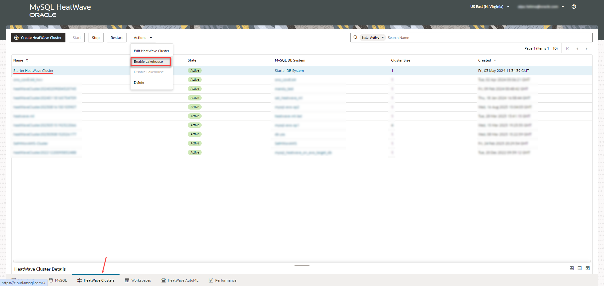
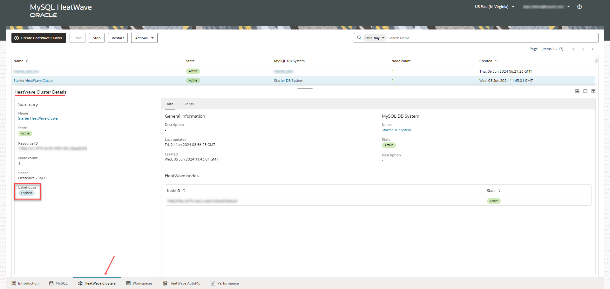
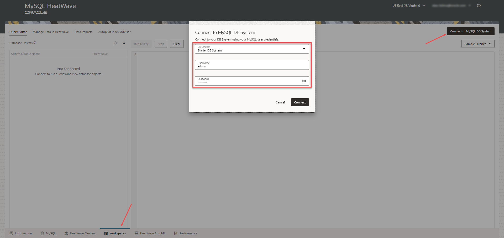
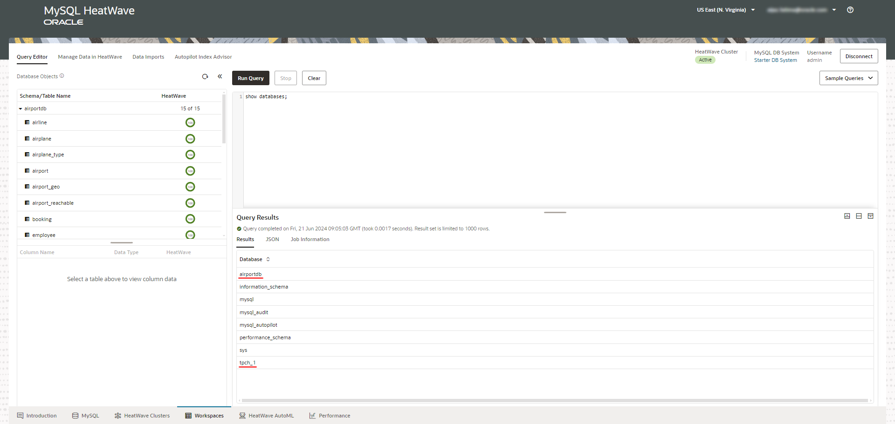
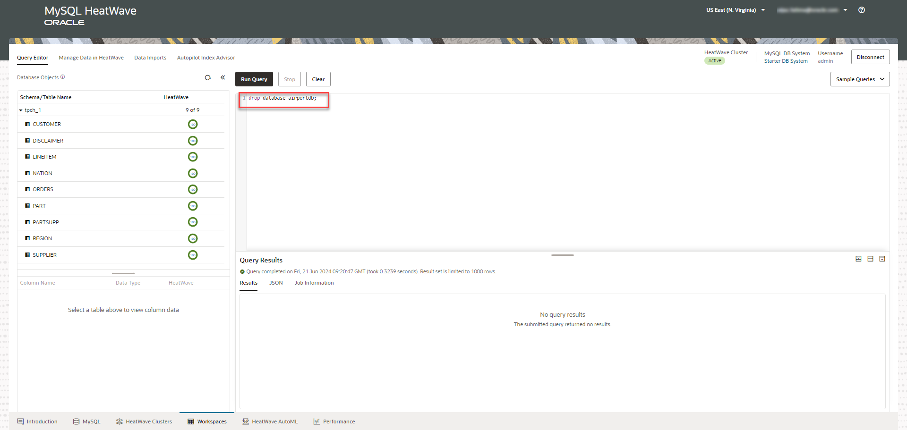
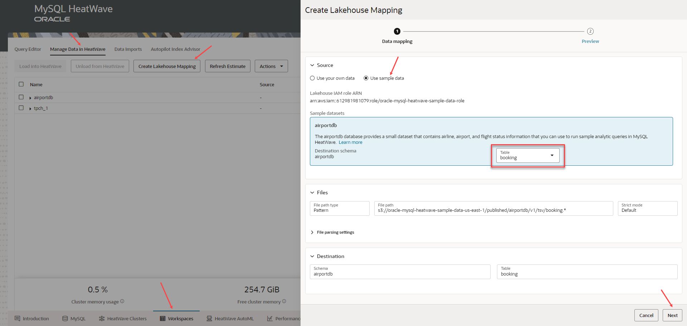
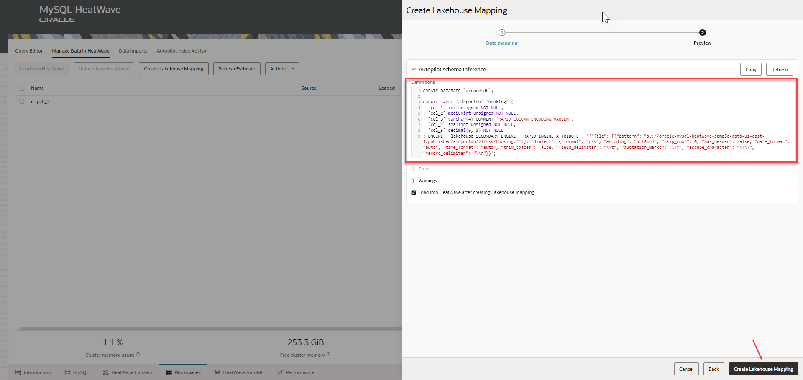
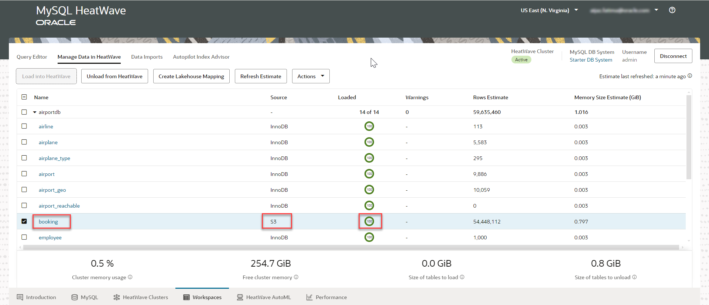

# Create Lakehouse Mapping

## Introduction

In this lab you will map a table from the sample schema, airportdb, present in an Oracle-managed S3 bucket to HeatWave. Lakehouse mappings enable seamless and efficient data analysis directly on the data present in an Amazon S3 bucket. You don’t need to define the schema of the files in Amazon S3.  

_Estimated Time:_ 15 minutes

### Objectives

In this lab, you will be guided through the following tasks:

- Enable Lakehouse on the HeatWave cluster.
- Connect to the starter DB System.
- Create Lakehouse Mapping.

### Prerequisites

- Must complete Lab 1.

## Task 1:  Enable Lakehouse on the HeatWave cluster

1. Go to the **HeatWave Cluster** tab in the [Heatwave Console](https://cloud.mysql.com).

2. Select your HeatWave Cluster, and under **Actions**, Click **Enable Lakehouse**. 
    

3. Under **HeatWave Cluster Details**, you can see that Lakehouse is enabled.
    

## Task 2:  Connect to the Starter DB System

1. Go to the **Workspace tab**, and click **Connect to DB System**.
   
2. Select your DB System and enter the username and password that you had created in Lab 1.
    

3. In the **Query Editor** tab, you can see that the Starter DB System contains the airportdb and tpch_1 schemas, already loaded into HeatWave.
    

4. Drop the schema, airportdb by running the following query in the **Query Editor**. We will use Lakehouse to map the schema from an Oracle-managed S3 bucket.

    ```bash
    <copy>drop database airportdb;</copy> 
    ``` 
    

## Task 3: Create Lakehouse Mapping

HeatWave Autopilot, a machine learning-powered automation, adaptively samples a small fraction of data in Amazon S3 and infers the number of columns, their data types, and their precision, creates the table definition, and also the script needed to load the table into HeatWave. This works on files that contain some metadata, like Parquet and Avro, but also on files that contain no metadata, like CSV.

1. In the **Workspaces** tab, click **Manage Data in HeatWave**.

2. Click **Lakehouse Mapping**.

3. Select **Use sample data**. This enables you to map sample tables present in the airportdb schema in Oracle-managed S3 bucket. 

4. You can select any table from the drop down list, and rest of the details are populated automatically.

    

5. Select the **Load into HeatWave after creating Lakehouse mapping** checkbox to load data into HeatWave directly from the Amazon S3 bucket, and click **Create Lakehouse Mapping**. 

    

6. You can see the table, booking, loaded into HeatWave directly from S3.

    

You may now **proceed to the next lab**.

## Learn More

- [Heatwave on AWS Service Guide](https://dev.mysql.com/doc/heatwave-aws/en/)

- [MySQL Database Documentation](https://dev.mysql.com/)


## Acknowledgements

- **Author** - Aijaz Fatima, Product Manager
- **Contributors** - Mandy Pang, Senior Principal Product Manager
- **Last Updated By/Date** - Aijaz Fatima, Product Manager, June 2024