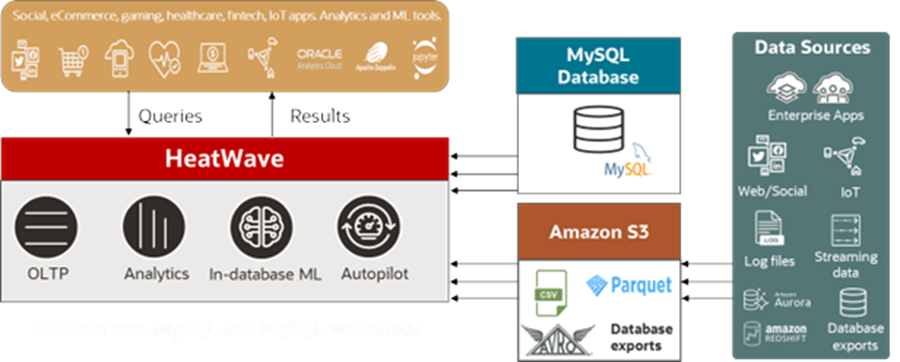

# Introduction

HeatWave on AWS is a powerful data platform that supports Lakehouse. This capability enables you to query data in Amazon S3 in various file formats, such as CSV, Parquet, and Avro, and exports from databases like Aurora, Redshift, MySQL, and Oracle. With Lakehouse, you can now query up to a quarter of a petabyte of data in Amazon S3 and combine it with transactional data in MySQL databases without copying the data from S3 into the MySQL database. Furthermore, you can perform machine learning (ML) tasks, such as training, predictions, and explanations, on this data stored in S3. This eliminates the need to load data into a database or move it to a machine learning service. The speed of querying data in Amazon S3 is on par with that of querying the data in the database. 

Lakehouse can scale up to 512 nodes, offering you the flexibility and power you need for your data and analytics tasks.

## About this Workshop

In this LiveLab, we will launch a starter DB System on HeatWave on AWS. Then, we will map the data in Amazon S3 to a new table in a schema on HeatWave on AWS. Subsequently, we will load the data into HeatWave to accelerate query processing. Finally, we will run queries on HeatWave and monitor the performance of the DB System and HeatWave Cluster.

_Estimated Time:_ 1.5 hours

## About Product/Technology

HeatWave on AWS delivers a true native experience for AWS customers. The console, control plane, and data plane completely reside in AWS and are responsible for managing the  HeatWave database resources in AWS. The control plane communicates with Oracle Cloud Infrastructure (OCI) Identity for account management, and with OCI metering & billing for monitoring and managing the usage and expenses associated with the customer’s account.

Once the user signs up for an OCI cloud account and registers their OCI account with HeatWave on AWS, the main interactions with the HeatWave service take place in AWS, through the service console hosted at  [cloud.mysql.com](https://cloud.mysql.com/login).

The following diagram illustrates HeatWave on AWS integration with Oracle Cloud Infrastructure (OCI).

## Objectives

In this lab, you will be guided through the following steps:

- Launch a starter DB system
- Create Lakehouse mapping
- Load data into HeatWave
- Run queries on HeatWave
- Monitor performance

## Prerequisites

Please make sure you can sign in to your HeatWave OCI Cloud Account. See [Sign Up](https://dev.mysql.com/doc/heatwave-aws/en/heatwave-aws-sign-procedure.html).

## Learn More

- [HeatWave on AWS Service Guide](https://dev.mysql.com/doc/heatwave-aws/en/)

- [MySQL Documentation](https://dev.mysql.com/)

## Acknowledgements

- **Author** - Aijaz Fatima, Product Manager
- **Contributors** - Mandy Pang, Senior Principal Product Manager
- **Last Updated By/Date** - Aijaz Fatima, Product Manager, June 2024
