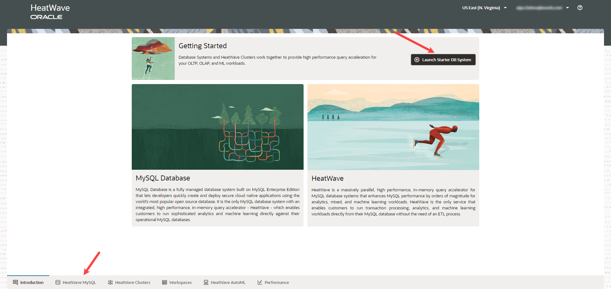
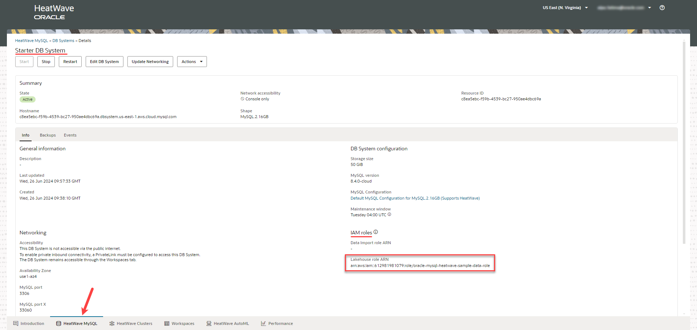

# Launch a starter DB system

## Introduction

In this lab you will launch a starter DB system. A starter DB System is a preconfigured HeatWave DB System with preloaded sample data.

_Estimated Time:_ 15 minutes

### Objectives

In this lab, you will be guided through the following tasks:

- Signin to Heatwave on AWS Service console page.
- Launch a starter DB system.
- Specify an IAM role in the starter DB system.

### Prerequisites

- A Heatwave on AWS Trial or Paid Cloud Account. If you are a first-time user, follow the  [Sign Up](https://dev.mysql.com/doc/heatwave-aws/en/heatwave-aws-sign-procedure.html) instructions.

## Task 1: Sign in to Heatwave on AWS Service console page

1. Go to the [Heatwave Console](https://cloud.mysql.com).

2. Enter your **Cloud Account Name** then click the **Continue** button.
    

3. Enter the OCI account credentials. This is your User Name and Password.  Click the **Sign In** button.
    

## Task 2: Launch a starter DB System

1. Launch a Starter DB System to create a pre-configured DB with pre-loaded sample data. 

    

2. Enter administrator credentials. Note the credentials as you will need them to connect to the DB System. The DB System should be created in a few minutes.

    

3. Once the DB system is created, click the name of the DB System to see the detailed information.

    

## Task 3: Specify an IAM role in the starter DB System

1. You need to specify an IAM role with the correct policies and trust relationships to grant the HeatWave DB System access to the data in Amazon S3. This will provide enhanced security, making it suitable for enterprise production workloads. We have created a sample Lakehouse role with the necessary policies and permissions to help you with Lakehouse mapping. Edit the Starter DB System and choose the sample Lakehouse role.

    

2. Click the name of the DB System to see the updated Lakehouse ARN.

    

You may now **proceed to the next lab**.

## Learn More

- [Heatwave on AWS Service Guide](https://dev.mysql.com/doc/heatwave-aws/en/)

- [MySQL Database Documentation](https://dev.mysql.com/)

## Acknowledgements

- **Author** - Aijaz Fatima, Product Manager
- **Contributors** - Mandy Pang, Senior Principal Product Manager, Aijaz Fatima, Product Manager
- **Last Updated By/Date** - Aijaz Fatima, Product Manager, June 2024