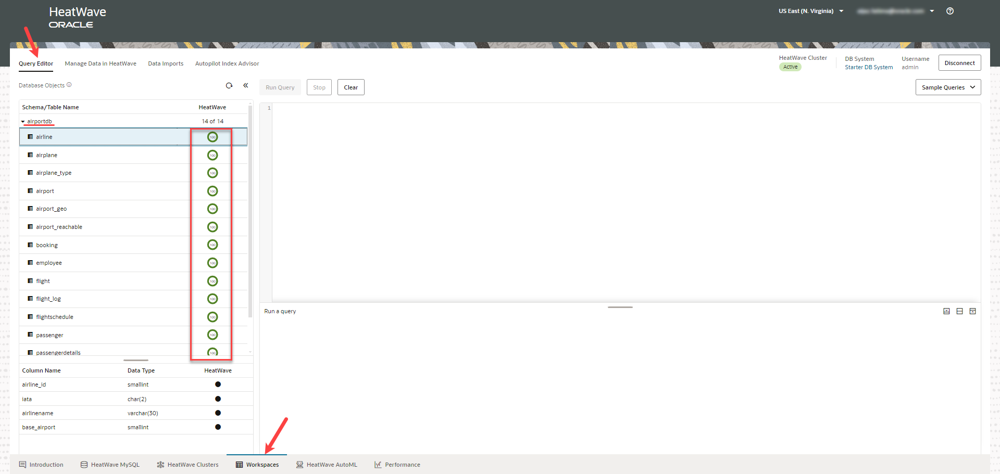
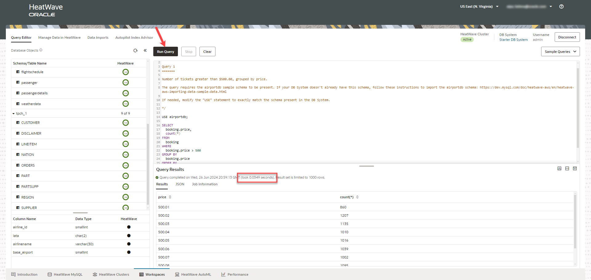

# Run Queries in HeatWave

## Introduction

HeatWave console provides a Query Editor to ease your interaction with the DB system eliminating the need to go back and forth between the Console and an external MySQL client for resource and data management.

_Estimated Time:_ 10 minutes

### Objectives

In this lab, you will be guided through the following task:

- Connect to the Starter DB System.
- Run queries with  HeatWave.
- Drop a table from the schema, airportdb.

### Prerequisites

- Must complete Lab 1.


## Task 1:  Connect to the Starter DB System

1. Go to the **Workspaces** tab, and click **Connect to DB System**.
   
2. Select your DB System and enter the username and password you had created in Lab 1.
    

3. In the **Query Editor** tab, you can see that the starter DB System contains the schemas, <i>airportdb</i> and <i>tpch_1</i>, already loaded into HeatWave.
    

## Task 2: Run queries with HeatWave

1. Click the **Query Editor** tab.

2. Click **Sample Queries** and then click **Sample AirportDB Queries**.

 

3. Copy Query 1, and click **Cancel**. 

 

4. Paste the query in the **Query Editor**.

5. Click **Run Query** to run the query.

    When you run the query with HeatWave, it took only 0.0446 seconds.

    

## Task 3: Drop a table from the schema

Let us drop the table, <i>booking</i>, from the schema, <i>airportdb</i>. We will use Lakehouse to map the table from an Oracle-managed S3 bucket.

 1. Drop the table, <i>booking</i>, from the schema, <i>airportdb</i>, by running the following query in the **Query Editor**. 

    ```bash
    <copy>use airportdb;
    drop table booking;</copy> 
    ``` 
    

You may now **proceed to the next lab**.

## Learn More

- [Heatwave on AWS Service Guide](https://dev.mysql.com/doc/heatwave-aws/en/)

- [HeatWave Lakehouse Documentation](https://dev.mysql.com/doc/heatwave/en/mys-hw-lakehouse.html)

- [MySQL Documentation](https://dev.mysql.com/)

## Acknowledgements

- **Author** - Aijaz Fatima, Product Manager
- **Contributors** - Mandy Pang, Senior Principal Product Manager
- **Last Updated By/Date** - Aijaz Fatima, Product Manager, June 2024

